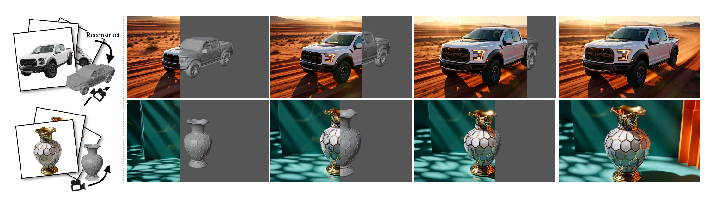

<h1 align="center">GO-Renderer: Generative Object Rendering with 3D-aware Controllable Video Diffusion Models</h1>

<p align="center">
  <a href="https://scholar.google.com/citations?user=Y8AU3RkAAAAJ&hl=en" target="_blank" rel="noopener noreferrer">Zekai Gu</a><sup>1,2</sup>,
  Shuoxuan Feng<sup>3</sup>,
  Yansong Wang<sup>4</sup>,
  <a href="https://openreview.net/profile?id=~Hanzhuo_Huang1" target="_blank" rel="noopener noreferrer">Hanzhuo Huang</a><sup>5</sup>,
  Zhongshuo Du<sup>1</sup>,
  <a href="https://afterjourney00.github.io/" target="_blank" rel="noopener noreferrer">Chengfeng Zhao</a><sup>1</sup>,
  <a href="https://github.com/ChernweiRen" target="_blank" rel="noopener noreferrer">Chengwei Ren</a><sup>1</sup>,
  <a href="https://totoro97.github.io/" target="_blank" rel="noopener noreferrer">Peng Wang</a><sup>2‡</sup>,
  <a href="https://liuyuan-pal.github.io/" target="_blank" rel="noopener noreferrer">Yuan Liu</a><sup>1†</sup>
</p>

<p align="center">
  <sup>1</sup>HKUST &nbsp;&nbsp;
  <sup>2</sup>VAST &nbsp;&nbsp;
  <sup>3</sup>Nanyang Technological University &nbsp;&nbsp;
  <sup>4</sup>Tsinghua University &nbsp;&nbsp;
  <sup>5</sup>ShanghaiTech University
</p>

<p align="center">
  <sup>†</sup> Corresponding author &nbsp;&nbsp;
  <sup>‡</sup> Project leader
</p>

<p align="center">
  <a href="https://arxiv.org/abs/2603.23246">ArXiv</a> &nbsp;|&nbsp;
  <a href="https://igl-hkust.github.io/GO-Renderer/">Project Page</a> &nbsp;|&nbsp;
  <a href="https://github.com/IGL-HKUST/GO-Renderer">Code</a>
</p>

<p align="center">
  
</p>

GO-Renderer integrates reconstructed 3D proxies with controllable video diffusion models to render objects on arbitrary viewpoints under arbitrary lighting conditions. The 3D proxy provides accurate structural guidance and viewpoint control, while the generative model supplies realistic appearance priors for novel environments, relighting, and object insertion.

## Abstract

Reconstructing a renderable 3D model from images is a useful but challenging task. Recent feedforward 3D reconstruction methods have demonstrated remarkable success in efficiently recovering geometry, but still cannot accurately model the complex appearances of these 3D reconstructed models. Recent diffusion-based generative models can synthesize realistic images or videos of an object using reference images without explicitly modeling its appearance, which provides a promising direction for object rendering, but lacks accurate control over the viewpoints. In this paper, we propose GO-Renderer, a unified framework integrating the reconstructed 3D proxies to guide the video generative models to achieve high-quality object rendering on arbitrary viewpoints under arbitrary lighting conditions. Our method not only enjoys the accurate viewpoint control using the reconstructed 3D proxy but also enables high-quality rendering in different lighting environments using diffusion generative models without explicitly modeling complex materials and lighting. Extensive experiments demonstrate that GO-Renderer achieves state-of-the-art performance across the object rendering tasks, including synthesizing images on new viewpoints, rendering the objects in a novel lighting environment, and inserting an object into an existing video.

## News

- **[2026.03]** The GO-Renderer paper is available on
  [arXiv](https://arxiv.org/abs/2603.23246).
- Training and inference code is provided for GO-Renderer 5B and the
  experimental GO-Renderer 14B implementation.

## Supported Models

| Model | Base model | Model link |
| --- | --- | --- |
| GO-Renderer 5B | Wan2.2-Fun-5B-Control | To be released |
| GO-Renderer 14B | Wan2.1-Fun-V1.1-14B-Control | [EXCAI/GO-Renderer-14B](https://huggingface.co/EXCAI/GO-Renderer-14B) |

## Quick Start

### 1. Environment Setup

Clone the repository and create a Conda environment:

```bash
git clone https://github.com/IGL-HKUST/GO-Renderer.git
cd GO-Renderer

conda create -n go-renderer python=3.10 -y
conda activate go-renderer
```

Install a CUDA-compatible PyTorch build. The following command uses CUDA 12.1:

```bash
conda install pytorch==2.4.1 torchvision==0.19.1 pytorch-cuda=12.1 \
  -c pytorch -c nvidia -y
```

If your driver or CUDA runtime differs, select the matching PyTorch command for
your system. Then install GO-Renderer and its Python dependencies:

```bash
python -m pip install --upgrade pip setuptools wheel
python -m pip install -e .
```

FlashAttention is strongly recommended for release-resolution inference and
training:

```bash
python -m pip install flash-attn --no-build-isolation
```

### 2. Model Preparation

Place the complete GO-Renderer model directories under
`models/Diffusion_Transformer/`, or edit `MODEL_PATH` in the shell scripts to
point elsewhere. Each directory must contain the trained GO-Renderer
Transformer together with its T5 encoder, VAE, tokenizer, and (for 14B) CLIP
image encoder:

```text
models/
└── Diffusion_Transformer/
    ├── GO-Renderer-5B/
    └── GO-Renderer-14B/
```

Inference and training load every frozen and trainable component from this one
directory; no separate base-model or Transformer-checkpoint argument is
required.

### 3. Inference Data

GO-Renderer expects precomputed object coordinate maps. An object coordinate
map, abbreviated as `coordmap`, is a three-channel image whose valid pixels
encode positions in an object-centric coordinate system.

Reference RGB and reference coordmap inputs must contain the same number of
frames in the same order. Preserve the white invalid-background convention
used by the included examples.

An inference metadata file is a JSON list:

```json
[
  {
    "type": "video",
    "name": "example_t2v",
    "mode": "t2v",
    "seed": 42,
    "text": "A glass figurine is placed outdoors while the camera moves.",
    "ref": "example/ref.mp4",
    "ref_coordmap": "example/ref_coordmap.mp4",
    "fg_coordmap": "example/target_coordmap.mp4"
  }
]
```

Required fields:

- `text`: text prompt.
- `ref`: multi-view reference RGB video or image directory.
- `ref_coordmap`: coordmaps aligned frame-for-frame with `ref`.
- `fg_coordmap`: coordmap sequence along the target camera trajectory. The
  historical field name is retained for checkpoint compatibility.

Optional fields:

- `seed`: per-sample random seed; it overrides the command-line seed.
- `firstframe`: first-frame appearance condition for i2v inference.
- `bg` or `bgvideo`: image or video environment condition.
- `gt`: optional ground-truth video used only in the visual comparison.

Media paths may be absolute or relative to the metadata JSON file. Condition
videos are resized and temporally resampled to the requested output shape when
needed.

## Inference

The launchers keep all user-editable values at the top of each file. Update the
model path, metadata path, output directory, and GPU ID before running.

### GO-Renderer 5B

```bash
bash scripts/go_renderer_5b/infer.sh
```

### GO-Renderer 14B

```bash
bash scripts/go_renderer_14b/infer.sh
```

Each sample produces:

```text
sample_0000/
├── generated.mp4
├── comparison.mp4
├── prompt.txt
└── run_config.json
```

`run_config.json` records the resolved seed, media paths, model directory, output
shape, sampler, and other inference arguments.

## Training

### Training Data

Training metadata is also a JSON list:

```json
[
  {
    "type": "video",
    "file_path": "example/target.mp4",
    "text": "An object rendered along the requested camera trajectory.",
    "ref": "example/ref.mp4",
    "ref_coordmap": "example/ref_coordmap.mp4",
    "fg_coordmap": "example/target_coordmap.mp4"
  }
]
```

Training paths are resolved relative to `TRAIN_DATA_DIR`. The `ref` and
`ref_coordmap` inputs must use the same carrier type—either two videos or two
image directories—so that the same spatial transform can be applied to both.

Before launch, edit `TRAIN_DATA_DIR`, `TRAIN_DATA_META`, model paths, GPU IDs,
and output paths at the top of the training script.

### Train GO-Renderer 5B

The default launcher uses eight local GPUs and DeepSpeed ZeRO-2:

```bash
bash scripts/go_renderer_5b/train.sh
```

### Train GO-Renderer 14B

The experimental 14B launcher uses eight local GPUs and Fully Sharded Data
Parallel training:

```bash
bash scripts/go_renderer_14b/train.sh
```

Fully Sharded Data Parallel, abbreviated as FSDP, shards model parameters,
gradients, and optimizer state across participating GPUs.

Both launchers include CrystalPig validation settings. Run the underlying
Python entry point with `--help` for all optimization, validation, checkpoint,
and resume options.

Resume only from checkpoints you trust. Distributed runtime checkpoints may
contain Python pickle files in addition to safetensors and JSON state.

## Repository Structure

```text
assets/validation/           CrystalPig and Furiren inference inputs
config/                      Wan2.1, Wan2.2, and distributed configurations
go_renderer/                 Models, pipelines, data, and utilities
scripts/go_renderer_5b/      5B training and inference launchers
scripts/go_renderer_14b/     14B training and inference launchers
tests/                       Regression and release checks
```

## Citation

If you find GO-Renderer useful, please cite:

```bibtex
@article{gu2026gorenderer,
  title   = {GO-Renderer: Geometry-Guided Object Rendering for Controllable Video Generation},
  author  = {Gu, Zekai and Dai, Bo and Fu, Yanwei and Wetzstein, Gordon and Tan, Ping},
  journal = {arXiv preprint arXiv:2603.23246},
  year    = {2026}
}
```

Machine-readable citation metadata is provided in
[`CITATION.cff`](CITATION.cff).

## Acknowledgements

This codebase builds on ideas and components from
[VideoX-Fun](https://github.com/aigc-apps/VideoX-Fun),
[Diffusers](https://github.com/huggingface/diffusers),
[Wan2.1](https://github.com/Wan-Video/Wan2.1), and
[Wan2.2](https://github.com/Wan-Video/Wan2.2). See [`NOTICE`](NOTICE) for the
complete attribution record.

## License

The source code is released under the Apache License 2.0. See
[`LICENSE`](LICENSE) for the license terms. This source-code license does not
grant rights to base-model weights, GO-Renderer checkpoints, or training data.
